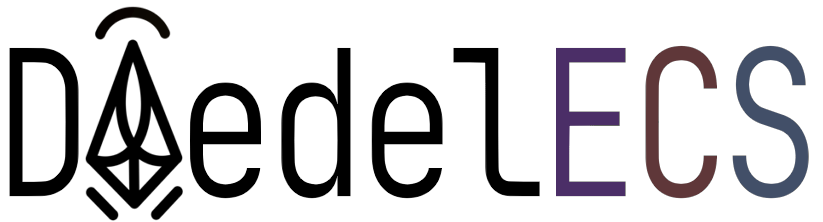

<!--suppress CheckImageSize -->


# What is DaedelECS?

DaedelECS is a lightweight, bare-bones, extensible Entity Component System implementation written entirely in Safe Rust.
It is published under the MIT License.
It is still under active development, so expect frequent breaking changes.

# Important Notes

It is entirely written in safe rust, and the only dependencies are `quote` and `syn`, both battle-tested pieces of
software, with over $600$ million and $900$ million downloads respectively. If there is a memory error, It is not
from this crate. This library is expecting an up-to-date Rust version, using the 2024 edition or later.

# Minimum Viable Use

Add the following to your `Cargo.toml`

```toml
[dependancies]
daedelecs = "0"
daedelecs-core = "0"
```

And paste the following example code into your `main.rs`

```rust
#[derive(Component)]
struct ExampleComponent {}
struct ExampleSystem {}
impl System<()> for ExampleSystem {
    type Data = ExampleComponent;

    fn run(_entity: &mut Entity, _world: &mut World<()>) {
        print!("Hello DaedelECS!")
    }
}
fn main() {
    let mut world = World::new(());
    Entity::builder()
        .with(ExampleComponent {})
        .add_to_world(&mut world);
    world.run_system::<ExampleSystem>();
}
```
